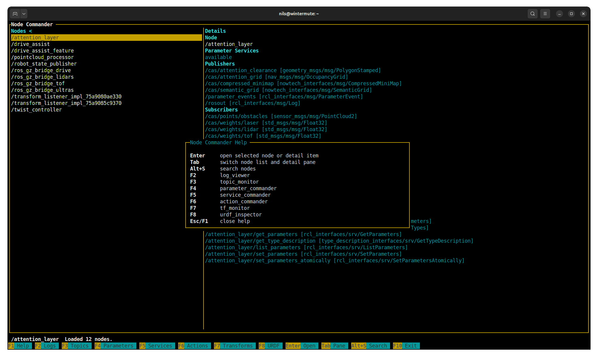

# ros2_console_tools

`ros2_console_tools` is a terminal-first toolbox for ROS 2 runtime inspection, visualization, and operator workflows, plus a small set of host-side tools for `systemd` service management and `journalctl` log reading.

Current package release: `1.5.0`.



## Quick Start

Build the package:

```bash
colcon build --packages-select ros2_console_tools
source install/setup.bash
```

Launch a tool:

```bash
ros2 run ros2_console_tools node_commander
ros2 run ros2_console_tools topic_monitor
ros2 run ros2_console_tools systemd_commander
```

## Toolset

### ROS graph and runtime tools

| Binary | Purpose | Highlights |
| --- | --- | --- |
| `node_commander` | Browse the live ROS 2 graph. | Node list, graph interface details, parameter service reachability, launcher hub for other ROS tools. |
| `parameter_commander` | Inspect and edit parameters on a selected node. | Namespace-folded parameter tree, scalar and array editing, descriptor and constraint display. |
| `topic_monitor` | Inspect topics and monitor live traffic. | Rate and bandwidth stats, decoded message view, topic search, embedded `map_viewer` and `image_viewer` launch for compatible topics. |
| `service_commander` | Inspect and call ROS 2 services. | Generic introspection-based request/response view, scalar request editing, interactive calls. |
| `action_commander` | Inspect ROS 2 actions. | Protocol endpoint breakdown, server/client node lists, action graph visibility. |
| `log_viewer` | Read `/rosout` in the terminal. | Source filtering, severity filtering, text filter, detail popup, local source-code inspection when paths are available. |
| `diagnostics_viewer` | Monitor `/diagnostics` and `/diagnostics_agg`. | Status list, severity filtering, key/value detail view, search. |
| `tf_monitor` | Inspect the live TF tree. | Transform freshness, stale highlighting, relative transform popup between selected frames. |
| `urdf_inspector` | Inspect `robot_description`. | Tree view of links and joints, details pane, XML inspection popup with syntax highlighting. |

### Visualization tools

| Binary | Purpose | Highlights |
| --- | --- | --- |
| `map_viewer` | Render `nav_msgs/msg/OccupancyGrid` in the terminal. | Rotated map rendering, costmap-style blocks, legend and monochrome controls. |
| `image_viewer` | Render `sensor_msgs/msg/Image` in the terminal. | Grayscale image view, zoom, pan, invert, render mode switching, frame freeze. |

### Host-side tools

| Binary | Purpose | Highlights |
| --- | --- | --- |
| `systemd_commander` | Manage `systemd` service units from the same ncurses UI style. | Service list, detail popup, start/stop/restart/reload actions, in-app unit file editor with syntax highlighting, `F9` jump into logs. |
| `journal_viewer` | Read system journal entries with the same interaction model. | Live mode with newest entries on top, full snapshot mode, priority filter, text filter, detail popup. |

## Common Interaction Model

Most tools share the same ncurses foundation and keybinding style:

- `F10`: exit
- `Esc`: back or close the current popup
- `Enter`: inspect, open, or focus the selected item
- `Alt+S`: incremental search where list search is supported
- `F4`: refresh the current scope
- `Alt+T`: toggle the embedded terminal pane where available

The exact action keys vary by tool, but the overall interaction model is intentionally consistent across the package.

## Architecture

Most tools follow the same structure:

- public header: `include/ros2_console_tools/<tool>.hpp`
- backend implementation: `src/<tool>_backend.cpp`
- screen/controller: `src/<tool>_screen.cpp`
- thin executable wrapper: `src/<tool>.cpp`

Shared TUI infrastructure lives in:

- [include/ros2_console_tools/tui.hpp](include/ros2_console_tools/tui.hpp)
- [src/tui.cpp](src/tui.cpp)

That shared layer provides:

- ncurses session setup and teardown
- theme and color roles
- status and help bars
- popup help bars
- layout helpers
- incremental search helpers
- an embedded PTY-backed terminal pane

There are now two backend styles in the repository:

- ROS-backed tools use `rclcpp::Node` backends for subscriptions, clients, graph queries, and cached runtime state.
- Host-side tools use plain backend/client classes. `systemd_commander` and `journal_viewer` are built around [include/ros2_console_tools/process_runner.hpp](include/ros2_console_tools/process_runner.hpp), [include/ros2_console_tools/systemd_client.hpp](include/ros2_console_tools/systemd_client.hpp), and [include/ros2_console_tools/journal_client.hpp](include/ros2_console_tools/journal_client.hpp).

## Notable Integration Points

- `node_commander` is the main ROS entry point and launcher hub.
- `topic_monitor` can open `map_viewer` for occupancy grids and `image_viewer` for image topics.
- `systemd_commander` opens `journal_viewer` for the selected unit on `F9`.
- `systemd_commander` keeps the main TUI unprivileged and only authenticates on demand for actions that require elevated privileges.

## Notes

- `systemd_commander` and `journal_viewer` rely on local `systemctl` and `journalctl` availability.
- Privileged host operations authenticate on demand instead of running the whole application as `root`.
- `service_commander` is currently strongest for scalar request editing; richer structured editing still needs dedicated UI work.
- `action_commander` is currently inspection-focused and does not yet provide full interactive goal execution.
